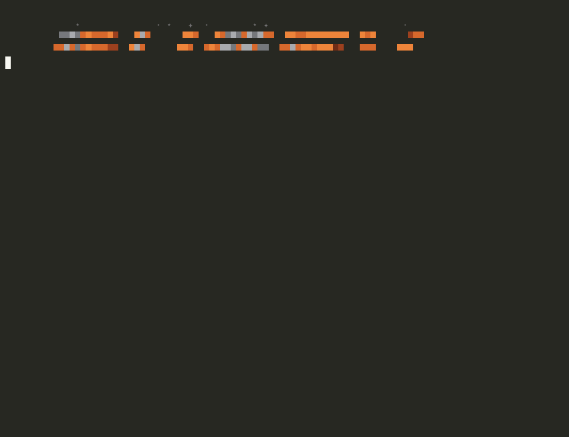
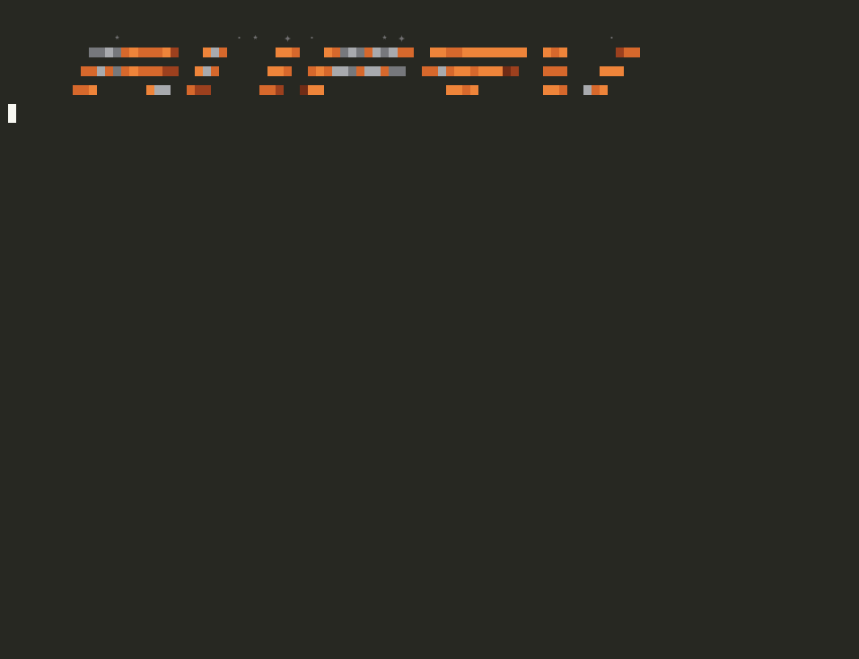
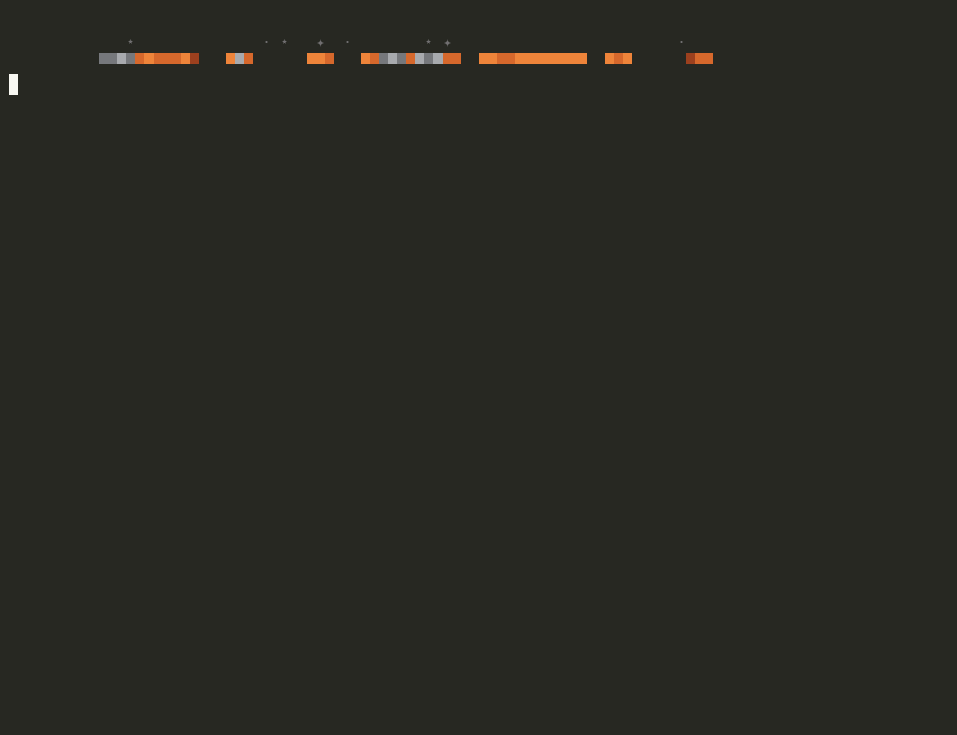

<div align="center">

```
   ⋆        ·      ✦                 ·    ⋆               ✧        ·
          ▀▀▀▀▀▀▀▀▀▀▀   ▀▀▀      ▀▀▀   ▀▀▀▀▀▀▀▀▀▀▀  ▀▀▀▀▀▀▀▀▀▀▀▀  ▀▀▀      ▀▀▀
         ▀▀▀▀▀▀▀▀▀▀▀▀  ▀▀▀      ▀▀▀  ▀▀▀▀▀▀▀▀▀▀▀▀  ▀▀▀▀▀▀▀▀▀▀▀▀   ▀▀▀    ▀▀▀
        ▀▀▀      ▀▀▀  ▀▀▀      ▀▀▀  ▀▀▀               ▀▀▀▀        ▀▀▀  ▀▀▀
       ▀▀▀      ▀▀▀  ▀▀▀      ▀▀▀  ▀▀▀▀▀▀▀▀▀▀▀       ▀▀▀▀         ▀▀▀▀▀▀
      ▀▀▀▀▀▀▀▀▀▀▀   ▀▀▀      ▀▀▀   ▀▀▀▀▀▀▀▀▀▀▀      ▀▀▀▀          ▀▀▀▀
     ▀▀▀▀▀▀▀▀▀▀    ▀▀▀      ▀▀▀           ▀▀▀      ▀▀▀▀          ▀▀▀▀
    ▀▀▀    ▀▀▀    ▀▀▀      ▀▀▀           ▀▀▀      ▀▀▀▀          ▀▀▀▀
   ▀▀▀     ▀▀▀   ▀▀▀▀▀▀▀▀▀▀▀▀  ▀▀▀▀▀▀▀▀▀▀▀▀      ▀▀▀▀          ▀▀▀▀
  ▀▀▀      ▀▀▀   ▀▀▀▀▀▀▀▀▀▀   ▀▀▀▀▀▀▀▀▀▀▀       ▀▀▀▀          ▀▀▀▀
     ·         ✦ ⋆        ·  ✦        ⋆ ·              ⋆          ✧
```

**A coding agent for your terminal. Written in Rust.**

*All the good parts of modern coding agents. None of the stuff that wears you down.*




<sub>A real session (idle pauses trimmed, played back a little faster). rusty finds two real bugs in a discount module, fixes both, and proves it by running the tests.</sub>

</div>

---

## Why rusty

Coding agents are great for the first twenty minutes of a task and shaky for
the next three hours. They forget what you said once the context fills up.
They announce "done" without running anything. They ask before `ls`, then wave
through `rm -rf`. Their memory turns into a junk drawer pasted into every
prompt. And you find out what they cost when the bill arrives.

rusty is built around fixing exactly those problems. It's one static binary
with no telemetry, it works with any OpenAI-compatible endpoint, and by default
it runs on open models hosted by NVIDIA.

## See it work

Every clip below is a real session, recorded with
[`scripts/record.py`](scripts/record.py) against the toy store in
[`demo/shop`](demo/shop) (or against rusty's own source). The only edits are trimmed idle pauses and
faster playback. Run them yourself and you'll get the same kind of result.

### A swarm, when one pair of eyes isn't enough



`/agents auto`, then one sentence. rusty starts four read-only workers, one per
module, each with its own context. It shows each one finishing, then merges
their reports into a ranked list. The two real bugs come out on top.
<sub>(Sped up 2×.)</sub>

### `/goal`: keep going until it's actually done


Goal mode plans, writes `shop/cli.py` and its tests, and runs them. It also
checks the edge cases by hand. It can only finish by calling `goal_done` with
evidence, so "I think it works" doesn't count.

### `/compact`: a summary that doesn't forget


rusty reads two of its own source files (12.6k tokens). `/compact keep how the
working set is built` shrinks that to **864 tokens** and saves three lasting
facts to memory. The follow-up question is answered correctly **without
reading a single file again**. Your messages and a list of files changed and
commands run are carried over verbatim, so the summary can't lose them.

### Focus mode, memory, permissions and token honesty



`/view adhd` gets you one status line and an answer in three bullets.
`/remember` saves a lesson for future sessions. `/permissions check` shows the
classifier at work: `rm -rf` asks first while `cargo test` just runs.
`/tokens` shows where every token went.

## Everything else

| | |
|---|---|
| **High-recall context** | Fixed token budgets. Old tool output gets trimmed first, because it can be re-read, and only then are older turns summarised. Your messages, the plan and the goal survive every compaction. |
| **Real memory** | Typed records (`preference`, `fact`, `decision`, `gotcha`), ranked with BM25 against each request and injected within a budget. Not a file pasted into every prompt. |
| **Permission classifier** | Builds, installs, feature-branch pushes and read-only cloud commands just run. Pushes to main, deploys and anything unclear ask. Force pushes, cloud and database deletes and `terraform destroy` need a typed yes every time, even in yolo. |
| **Execution modes** | `careful` has a read-only checker review finished work, `vibe` moves fast with a few read-only workers, `standard` sits in between. Separate from permissions. |
| **Infrastructure harness** | Knows where it's pointed: the banner and `/target` show the kube context, cloud account, Terraform workspace and branch, and a production target makes auto pick careful. In careful mode there's no apply without a diff or plan from the same session, a snapshot of what a change touches is taken before it runs, and the rollout is checked after. Every infra command goes into an audit log, and `/changes` shows what the session changed. See [docs/INFRA.md](docs/INFRA.md). |
| **Secrets stay out of the transcript** | Tool output is redacted before the model, the screen or a session file sees it. |
| **`/loop`** | `/loop 5m check CI and fix failures`, or let rusty set its own pace. |
| **Subagents and swarms** | `/agents sub\|swarm\|auto`. Swarm workers can rotate models and spread their temperatures. Off by default, so you never pay for tokens you didn't ask for. |
| **Skills** | `/review` `/explore` `/feature` `/debug` `/test` `/commit`, plus your own markdown skills per project or per user. |
| **Terminal-native tools** | `search` (ripgrep), `glob`, `outline` (definitions with line numbers), ranged `read_file`, exact `edit_file`, `bash`. Find first, then read only what you need. |
| **Token tips** | After a turn that spent heavily, one specific tip based on what actually happened, never generic nagging. |
| **Instant Ctrl-C** | Stops a turn mid-stream in about 15 ms, and the next turn works. Type while it works and your message runs next. Press Ctrl-C twice to quit. |
| **Looks good** | Rust-and-steel themes, a starfield banner with today's mission line, a star spinner with rotating verbs, grouped tool lines, rendered markdown. |

## Quickstart

```bash
git clone https://github.com/jadenfix/rusty && cd rusty
cp .env.example .env        # add NVIDIA_API_KEY (free at build.nvidia.com)
cargo install --path .
```

```bash
rusty                                         # interactive
rusty "why does the build fail?"              # one shot
rusty --goal "get cargo test green" --yolo    # unattended until verifiably done
rusty -c                                      # resume the last session here
```

Keys come from your shell, then `~/.config/rusty/.env`, then the `.env` next
to rusty's `Cargo.toml`. With several keys set (`NVIDIA_API_KEY`,
`NVIDIA_API_KEY_2`, …), rusty rotates through them and backs off politely
when rate limited.

## Commands

| | |
|---|---|
| `/goal <objective>` | autonomous until done and verified · `status` · `resume` · `clear` |
| `/loop [5m] [x10] <prompt>` | repeat on an interval, or self-paced |
| `/agents off\|sub\|swarm\|auto` | delegation · `/agents model <id>` sets the subagent model |
| `/swarm size\|models\|spread` | worker count (up to 64), model rotation, temperature spread |
| `/compact [focus]` | summarise now, keeping what you name in detail |
| `/target` · `/audit [n]` · `/changes` | where infra commands will land · the infra audit log · what this session changed |
| `/triage` `/change` `/postmortem` | infra skills: incident triage, a change plan with rollback, a blameless write-up |
| `/context` · `/tokens` | where the window is going · spend by model and by tool |
| `/memory` · `/remember` · `/forget` | long-term memory |
| `/permissions [mode]` | `read-only` `ask` `auto` `yolo` · `allow` · `deny` · `check <cmd>` |
| `/mode auto\|careful\|standard\|vibe` | how hard rusty thinks and checks its work |
| `/view default\|verbose\|adhd` | how much you see |
| `/theme` · `/font` | `rust` `neon` `matrix` `amber` `ice` `mono` · `rust` `block` `thin` `classic` |
| `/review` `/explore` `/feature` `/debug` `/test` `/commit` | built-in skills · `/skills` lists yours too |
| `/model` · `/models` · `/plan` · `/tips` · `/settings` · `/clear` · `/exit` | |

## Execution modes

How hard should rusty think, and how many times should it check its work?
That's separate from what it's allowed to do.

| | |
|---|---|
| `auto` | The default. rusty picks one of the three below for each request and says why on the first line: careful when it mentions production, a migration, a deploy, data, money, security, infrastructure or an incident; vibe for a quick prototype or sketch; standard otherwise, including whenever it's unsure. During a turn it only ever moves up to careful, when a consequential command comes up or three commands fail in a row. It never changes permissions or the model. |
| `careful` | Thinks longer. When it says it's done, a separate read-only checker looks at the real files and your instructions and reports what's wrong. rusty fixes that and verifies it, with no second review. A plain question isn't checked, and a goal is checked once. |
| `standard` | Normal effort, and it checks what it changed. |
| `vibe` | Quick passes and small checks. It can send out up to three read-only workers to look things up in parallel. It still has to run a relevant check before it calls something done. |

```bash
rusty --mode careful --goal "move the sessions table to the new schema without losing rows"
rusty --mode vibe "sketch a settings page"
```

Switch with `/mode auto|careful|standard|vibe`; the choice is saved, and an
explicit mode always beats auto. `--mode` or `RUSTY_MODE` sets it for one
run. To use a different model per mode, set
`RUSTY_CAREFUL_MODEL`, `RUSTY_STANDARD_MODEL` or `RUSTY_VIBE_MODEL`
(`--model` and `/model` still win). If you choose `/agents` settings
yourself, they stick; `/agents default` hands delegation back to the mode.

On the default NVIDIA model, careful and vibe also set the model's
reasoning budget. In a quick test, the low budget clearly cut reasoning,
but asking for "high" made no difference on easy questions. Whether careful
mode beats standard on real tasks is still being measured; see the evals
below.

## Permissions

Built for letting an agent run on its own, with a hard stop for anything
you can't take back.

```
                 reads, searches,   project edits,     pushes to main,    force push, cloud or
                 cloud reads        builds, installs,  deploys, PRs,      database deletes,
                                    feature pushes     anything unclear   rm -rf outside, disks
read-only            run               refused            refused            refused
ask                  run               asks               asks               needs you, every time
auto                 run               run                asks               needs you, every time  ← default
yolo                 run               run                run                needs you, every time
```

- **Runs on its own in auto:**
  - building, testing, linting and installing project dependencies;
  - deleting build folders (`rm -rf node_modules dist target`);
  - everyday git (commit, branch, rebase, pull, push a feature branch);
  - calls to your local dev server, and plain downloads;
  - read-only cloud commands: `aws … describe/list/get`, `kubectl get/logs/describe`, `terraform plan`, `gcloud … list`, `gh pr view`, `docker ps`, `SELECT` queries.
- **Asks first:**
  - pushing to `main` or another shared branch;
  - `git reset --hard` and anything else that throws away uncommitted work;
  - deploys, `terraform apply`, `kubectl apply`;
  - opening or merging pull requests;
  - writes outside the project;
  - reading `~/.aws/credentials` and other keys;
  - sending local data off the machine;
  - commands rusty doesn't recognise.
- **Needs a typed `yes` every time, even in yolo:**
  - force pushes and deleting remote branches or history;
  - `terraform destroy`;
  - cloud deletes (`aws s3 rm`, `kubectl delete`, `gcloud … delete`, `fly apps destroy`);
  - `DROP`, `TRUNCATE`, and `DELETE` without `WHERE`;
  - `prisma migrate reset`;
  - `rm -rf` outside the project;
  - disk writes.

  An allow rule can't skip this. With nobody at the keyboard (a script, CI, a benchmark), it's refused, and the model is told to hand the command to a person.

rusty looks at what a command will really run, not just its first word:
- the scripts it calls, `package.json` scripts, `make` targets;
- heredocs piped into a shell, and `$(…)` substitutions;
- commands sent through `ssh`, `docker exec` and `kubectl exec`;
- code passed to `python -c`.

So `npm run deploy` is judged by what `deploy` does.

`/permissions check <command>` shows the verdict and why. Deny rules always
win. At a prompt, `a` allows that kind of call from then on, and typing
anything else sends it back to the model as feedback.

## Verified end to end

Nothing here is a mock. The model is real, the terminal is real, and every
check is hidden from the agent.

| What | Result |
|---|---|
| `scripts/qa.sh`: fmt, clippy `-D warnings`, 33 unit tests (about 250 classified commands), 20 end-to-end tests on the real binary | pass |
| Live end-to-end against the model: bug fix, goal mode, swarm, Ctrl-C exit code | 4/4 |
| Real pseudo-terminal: Ctrl-C during a streaming turn | stops in ~10-70 ms, next turn works, double Ctrl-C quits |
| Single-turn evals: Python, Rust, JS, code search, cross-file rename, CLI flag | 6/6 |
| Multi-turn evals: change of plan midway, memory across sessions, a rule surviving compaction, undo one step, a long `/goal`, `/compact` with a focus | 6/6 |
| Inside a FullStack-Bench task container under Harbor | installs, works the task with the environment's own CLI, closes its goal with evidence |

```bash
scripts/qa.sh            # offline checks
scripts/qa.sh --live     # plus live tests, the terminal check and all 12 evals
scripts/eval.sh multi    # just the multi-turn evals; logs land in target/evals/
```

## Models

Anything your endpoint serves, chosen with `--model`, `RUSTY_MODEL` or `/model`.

| Model on NVIDIA's API | |
|---|---|
| `nvidia/nemotron-3-super-120b-a12b` | **default**, fast and dependable with tools (every demo above) |
| `nvidia/nemotron-3-ultra-550b-a55b` | bigger, slower, thinks harder |
| `z-ai/glm-5.3` | strong coder, slow to first token |
| `openai/gpt-oss-20b` | small and quick; a good swarm worker |

To use another endpoint, set `RUSTY_BASE_URL`, for example `http://localhost:11434/v1`.

## Run it anywhere

The core CLI is one static binary. `docker build --target bin -o out .` produces
`rusty` and the optional `rusty-memoryd` companion for Linux.
[docs/MEMORY.md](docs/MEMORY.md) covers opt-in `--memory off|on|deep`, the
compressed L1/L2 store, learning from feedback, live checks and cloud transfer.
[docs/CLOUD.md](docs/CLOUD.md) covers Daytona sandboxes
(`uv run cloud/daytona.py --repo … --goal …`), AWS, Devbox and Docker.
rusty also plugs into Harbor benchmarks with `--goal`, `--trajectory` and
`--stats`.

## Inside

```
  prompt · /goal · /loop
            │
  ┌─────────▼──────────── agent loop ───────────┐      ┌──────────────┐
  │ mode     auto ▸ careful · standard · vibe   │ ◀──▶ │ model, SSE   │
  │ context  budgets · elision · /compact       │      │ key rotation │
  │ memory   BM25 recall                        │      └──────────────┘
  └─────┬────────────────────────────────┬──────┘
        ▼                                ▼
  permissions ▸ infra ▸ tools        read-only workers
  runs · asks   target   bash        subagent · swarm
  · needs you   audit    files       careful checker
```

```
src/
  main.rs         CLI, REPL, slash commands, settings
  agent.rs        the loop: model ⇄ tools, goal, loop, subagents and swarms, compaction
  display.rs      grouped tool lines, status line, recaps, views
  llm.rs          streaming client on a background thread, tool-call assembly, key rotation
  tools.rs        read, write, edit, list, search, glob, outline, bash
  permissions.rs  the command classifier
  memory.rs       memory store and BM25 retrieval
  context.rs      budgets, elision, compaction, the working set
  skills.rs       built-in and user skills
  tips.rs         token tips from real usage
  markdown.rs     terminal markdown
  ui.rs           themes, banner, mission line, spinner
  execution.rs    careful, standard and vibe profiles, and auto's pick
  infra.rs        live target, dry-run gate, snapshots, audit log, redaction
```

Why it's built this way: [docs/DESIGN.md](docs/DESIGN.md) covers where coding
agents hold up on long tasks, where they fall apart, and what rusty does about
each.

## Contributing

Conventional Commits, and pull requests written by a person, for people. See
[CONTRIBUTING.md](CONTRIBUTING.md).

## License

MIT
