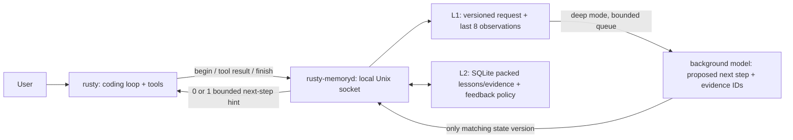

# Optional proactive memory

Build/install both executables (`cargo install --path .`). The normal CLI remains
one binary; the advisor is an optional second binary, `rusty-memoryd`, installed
beside it. No Python, vector database, downloaded embeddings or model weights
are required locally. Unix sockets currently support macOS and Linux.

```sh
rusty --memory on "find the monorepo and inspect its workspace"
rusty --memory deep --mode careful "investigate the failed migration"
rusty --memory off "fix this small bug"
```

| Memory mode | Work |
|---|---|
| `legacy` (default) | Existing JSONL/BM25 memory; compatibility with current users. |
| `off` | No advisor hooks, recall or writes from this agent. |
| `on` | Local L1/L2 advisor with an online intervention selector; no advisor model calls. |
| `deep` | Same fast path plus bounded background model analysis after failures or periodic tool observations. |

These are independent of `careful`, `standard`, `vibe`, delegation and tool
permissions. Careful still uses the existing single read-only checker. Deep
memory does not add review rounds or authorize commands. A service startup
failure degrades to memory off. Runtime hook failures return no advice.



## What learns today

The selector is a small online logistic model with four inputs: bias, lexical
overlap, smoothed explicit usefulness feedback, and whether a lesson is a
preference. Candidate filtering is lexical; the intervention decision is learned.
Initial weights and threshold are engineering defaults, **not calibrated
probabilities or a claim of optimal retrieval**. Strongly relevant saved facts
can resolve aliases such as a monorepo URL. Unmatched aliases remain unknown.

`/memory helpful` and `/memory harmful` rate the most recently delivered L2
intervention in this session and update the project policy. Task completion
alone is not treated as proof that a memory helped. The policy survives daemon
restarts. This improves the advisor; it does not fine-tune the coding model.

Deep analysis sees the bounded L1 request and observed tool evidence. It can
propose one next step or stay silent. Evidence IDs must exist in the supplied
observations; this checks provenance references, not semantic correctness.
Queued jobs are skipped before inference when their state version is stale.
Late proposals are discarded when the state version has changed. It cannot run
tools or write reusable lessons. If a fresh hint arrives during main-model
inference, deep mode can reconsider an unexecuted tool proposal before dispatch.
This costs another coding-model request and is counted in the normal request
totals; it is bounded by the four-intervention budget. It does not force another
review after the task is done. Durable lessons come from `remember`, explicit
user saves, or the CLI's existing context-compaction extraction; they are marked
as saved but not independently verified. Nothing is promoted merely on eviction.

This is an initial usable service, not yet a trained behavior predictor. A next
experiment is to collect explicitly rated interventions and held-out user
corrections, then compare this selector with a learned ranker. Do not train on
success labels without controlling for task difficulty and credit attribution.

## Bounded hot path and disk

- L1: RAM only, at most 32 sessions, each with a 4 KiB request and eight
  observations of at most 1 KiB arguments and 2 KiB output. Coding hooks do not
  write a database journal or checkpoint. Finish clears request/observations;
  a daemon restart loses L1 but preserves L2.
- Hooks: bounded queue of eight; caller waits at most 50 ms. The transport has a
  200 ms timeout so abandoned work also drains. Startup can take up to two
  seconds; explicit memory management has a separate one-second deadline.
- Advice: at most 800 bytes (`on`) or 1600 (`deep`), at most two/four
  interventions per turn, respectively. Repeated lessons are suppressed.
- L2: at most 512 active lessons across the local store. Text and evidence
  use gzip when smaller, otherwise bounded raw UTF-8. Existing plain-text
  lesson columns are migrated to packed blobs at service startup. The SQLite
  database has a 16 MiB page quota, a 512 KiB page-cache target, in-memory
  temporary tables and frequent WAL checkpoints with a 64 KiB retained-journal
  target. These targets are not a hard whole-process or whole-folder quota.
  Old duplicated event/checkpoint tables are removed and vacuumed once at
  upgrade; no vacuum runs on the coding path.
- Deep: one background worker, queue of four, at most four jobs per turn,
  20-second request timeout.
  The NVIDIA default model gets low reasoning effort and a 512-token reasoning
  budget within a 2048-token output cap. Other providers get a generic request.

Socket/files/directories use 0600/0600/0700. Persistence refuses symlinked
memory directories and files. A shared redactor covers Rusty hooks, direct
service saves, imports, session/trajectory JSON, history and audit metadata.
Imports containing recognizable credentials are rejected instead of silently
changing canonical lesson IDs. Startup sanitizes older saved lessons; unsafe
old IDs become tombstones. L1/tool observations are never written by the advisor.
The CLI's sessions/history and explicitly saved L2 lessons remain intentional
persistence; `--memory off` disables memory, not these separate session files.
Infrastructure snapshots containing recognizable secrets are refused rather
than persisting secrets or creating a redacted, invalid rollback artifact.

The redactor covers known token shapes, credential fields and configured secret
values. It is not an exhaustive detector of arbitrary or encoded secrets. These
files are access-controlled, not encrypted. SQLite secure deletion and WAL
truncation reduce retained deleted bytes, but do not erase OS swap, filesystem
snapshots, backups or already exported files. A forgotten lesson's tombstone
prevents old imports from resurrecting it. Imports preserve the local feedback
policy and reset imported lesson utility. The sidecar does not import legacy or
global memory automatically; all companion lessons, including preferences, are
project scoped.

`/memory status` shows L1 counts, RAM-only persistence, learning updates,
and background model requests/tokens/time. `--stats` and `--trajectory` include
hook counts, deadlines missed, injections, total hook time and maximum hook time.
The background-model totals are separate from the coding-model totals.

## Local operation and cloud transfer

The CLI starts the daemon on demand. To set its model environment explicitly:

```sh
RUSTY_MEMORY_MODEL=nvidia/nemotron-3-super-120b-a12b rusty-memoryd
```

Keep the same `RUSTY_PROJECT_ID` locally and in the cloud. Without an explicit
identity, worktrees sharing a Git common directory share memory; unrelated
clones do not. The daemon keeps the environment it was started with; restart it
when changing provider/model settings (`rusty-memoryd stop`, then start it
again). Automatically started daemons have their own process group, so stopping
a coding turn with Ctrl-C does not terminate memory. The binary supports an isolated
`--home` / `RUSTY_HOME` for separate accounts or experiments.

```sh
export RUSTY_PROJECT_ID=https://github.com/you/project
rusty-memoryd remember --kind fact "The monorepo URL is https://github.com/you/project"
rusty-memoryd status
rusty-memoryd export project-memory.json.gz
rusty-cloud run --repo "$RUSTY_PROJECT_ID" --memory-mode on \
  --memory-input project-memory.json.gz --project-id "$RUSTY_PROJECT_ID" \
  --goal "fix the failing tests"
```

Snapshots are scoped gzip JSON exports through the live service, not copies of
an active SQLite/WAL database. The export file is private and created without
replacing an existing file. Import with `rusty-memoryd import <file>` after
setting the matching project ID. An unrelated scope or invalid lesson ID fails
before modifying the database. There is no automatic cross-machine merge of
feedback weights; each machine retains its local learner.

The Docker export and Daytona snapshot now include both binaries and hash both
into the snapshot identity. The Daytona launcher uploads an optional memory
snapshot, runs the service **inside the same sandbox** as the coding process,
and exports `memory.json.gz` alongside the task results. Cloud session archives
exclude raw advisor database/WAL/socket files. A missing memory export preserves
the sandbox. This avoids a network hop for each memory hook; no Vercel service
is required on the hot path. Hosted Daytona execution still needs its own live
qualification; local shell stand-ins verify the launcher lifecycle.

## Checks and acceptance evidence

`cargo xtask qa` includes service tests and a real-CLI offline provider smoke.
The latter verifies `write_file`, `read_file`, `edit_file`, Bash execution,
the exact two-byte note payload, a preserved sentinel, scoped hint injection, memory off,
hook deadlines and a generous tool/repetition budget.

```sh
python3 scripts/memory_smoke.py --live --binary target/release/rusty \
  --report memory-live.json
```

The verifiers and receipts stay outside the task directory. Each run records
wall time, tokens, tools, repeated calls, hook metrics, background model metrics
and local storage bytes. A provider failure or timeout has its own classification
and remains a failed CI run; it is never silently counted as success.

The easy smoke defaults to NVIDIA-hosted Nemotron Super in `vibe` mode;
use `--model` to qualify another model. This is
separate from the normal CLI default and the deep advisor model.

GitHub's `memory-live.yml` runs the six easy cases only when manually dispatched,
using the repository `NVIDIA_API_KEY` secret. Pushes and merges never start model
calls automatically. It
does not expose a secret to forked PRs. Deterministic checks run separately in
`ci.yml`. This checks regression and overhead on small tasks, not FullStack-Bench
performance or evidence that memory improves hard-task success. Establish that
with paired, repeated off/on/deep trials and independently verified outcomes
before changing the default mode or the inference policy.
